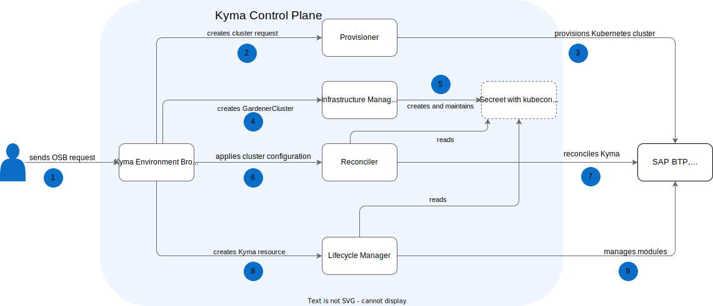

# Kyma Environment Broker architecture

The diagram and steps describe the Kyma Environment Broker (KEB) workflow and the roles of specific components in this process:

1. The user sends a request to create a new cluster with SAP BTP, Kyma runtime.

2. KEB sends the request to create a new cluster to the Runtime Provisioner component.

3. Provisioner creates a new cluster.

4. Kyma Environment Broker creates a cluster configuration in Reconciler (except for the preview plan).

5. Reconciler installs Kyma (except for the preview plan). 

6. KEB creates a Kyma resource.

7. Lifecycle Manager manages Kyma modules.

> **NOTE:** In the future, Provisioner and Reconciler will be deprecated.  KEB will then integrate with Infrastructure Manager. To learn about the planned KEB workflow, read [Kyma Environment Broker target architecture](02-03-target-architecture).
