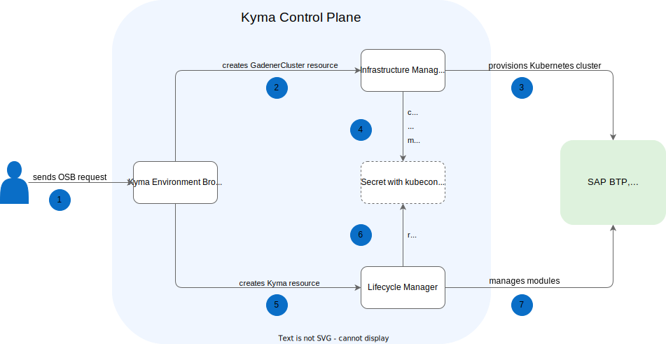

# Kyma Environment Broker target architecture

> **NOTE:** After Runtime Provisioner and Reconciler are deprecated, Kyma Environment Broker (KEB) will integrate with Infrastructure Manager. The diagram and description in this doc present the KEB target architecture. To read about the current KEB workflow, go to [Kyma Environment Broker architecture](02-01-architecture.md).

1. The user sends a request to create a new cluster with SAP BTP, Kyma runtime.
2. KEB creates a GardenerCluster resource.
3. Infrastructure Manager provisions a new Kubernetes cluster.
4. Infrastructure Manager creates and maintains a Secret containing a kubeconfig.
5. KEB creates a Kyma resource.
6. Lifecycle Manager reads the Secret every time it's needed.
7. Lifecycle Manager manages modules within SAP BTP, Kyma runtime.

> **NOTE:** Once the planned changes are implemented, the following documents will be deprecated as irrelevant:
> - [Runtime components](03-02-runtime-components.md)
> - [Set overrides for Kyma Runtime](03-06-runtime-overrides.md)
> - [Configure Kyma version](03-08-kyma-versions.md)
> - [Orchestration](03-10-orchestration.md)
