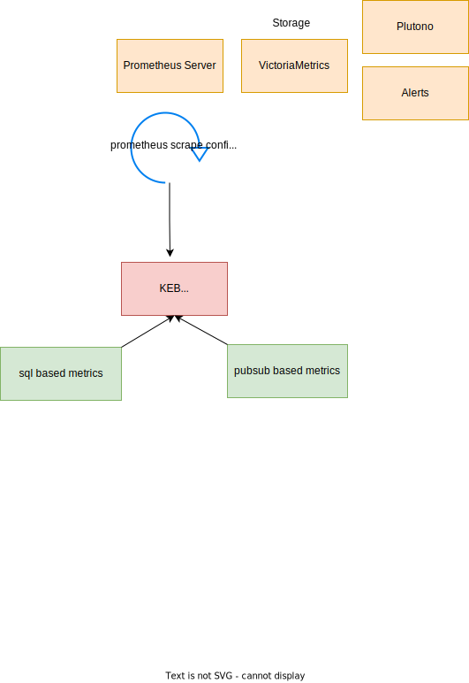

KEB metrics are exposed via the /metrics endpoint, which is called by prometheus in job manner every given duration of
time and gather the metrics which are later pushed to Victoria metrics and Plutno dashboard and alerts.

Metrics are counted in KEB memory by:
1. pull data from database and update in-memory metric.
2. pubsub architecture where events are send across systems from business processes to corresponding handlers which update metrics in memory.

Then the content of KEB memory prometheus metrics is pulled by prometheus server and persist in monitoring database for futher processing by monitoring and alert systems.

| metric name                                            | type      | labels                                                                                                  | source            |
|--------------------------------------------------------|-----------|---------------------------------------------------------------------------------------------------------|-------------------|
| kcp_keb_v2_ers_context_license_type_total              | gauge     | license_type                                                                                            | database          |
| kcp_keb_v2_global_account_id_instances_total           | gauge     | global_account_id                                                                                       | database          |
| kcp_keb_v2_instances_total                             | gauge     | -                                                                                                       | database          |
| kcp_keb_v2_deprovisioning_duration_minutes             | histogram | plan_id                                                                                                 | events            |
| kcp_keb_v2_provisioning_duration_minutes               | histogram | plan_id                                                                                                 | events            |
| kcp_keb_v2_operation_result                            | gauge     | operation_id, instance_id, global_account_id, plan_id, type, state, error_category, error_reason, error | events            |
| kcp_keb_v2_operations_provisioning_failed_total        | counter   | plan_id                                                                                                 | events + database |
| kcp_keb_v2_operations_provisioning_in_progress_total   | gauge     | plan_id                                                                                                 | events + database |
| kcp_keb_v2_operations_provisioning_succeeded_total     | counter   | plan_id                                                                                                 | events + database |
| kcp_keb_v2_operations_deprovisioning_failed_total      | counter   | plan_id                                                                                                 | events + database |
| kcp_keb_v2_operations_deprovisioning_in_progress_total | gauge     | plan_id                                                                                                 | events + database |
| kcp_keb_v2_operations_deprovisioning_succeeded_total   | counter   | plan_id                                                                                                 | events + database |
| kcp_keb_v2_operations_update_failed_total              | counter   | plan_id                                                                                                 | events + database |
| kcp_keb_v2_operations_update_in_progress_total         | gauge     | plan_id                                                                                                 | events + database |
| kcp_keb_v2_operations_update_succeeded_total           | counter   | plan_id                                                                                                 | events + database |